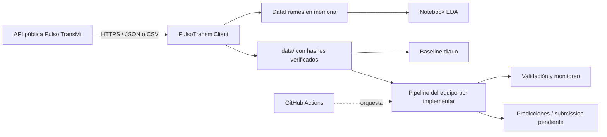

# Documentación técnica integral · Pulso TransMi SDK

## 1. Propósito y alcance

Este repositorio es un kit inicial para el reto académico **Pulso TransMi**. Su
objetivo es permitir que un equipo descargue datos sintéticos de demanda de
TransMilenio, explore su calidad y comportamiento, construya modelos de
pronóstico y prepare un pipeline MLOps reproducible.

El repositorio sí contiene:

- un cliente Python de solo lectura para la API pública;
- descarga verificable de los archivos completos;
- paginación automática de observaciones y contexto;
- un baseline diario y un EDA ejecutado;
- pruebas unitarias del cliente;
- una plantilla inicial de GitHub Actions;
- un modelo entidad–relación lógico de los datos publicados.

El repositorio todavía no contiene un pipeline completo de entrenamiento,
monitoreo, reentrenamiento o envío de predicciones. La plantilla de CI supone
que el equipo implementará `src.pipeline` y su archivo de dependencias.

## 2. Inventario del repositorio

```text
pulso-transmi-sdk/
├── src/pulso_transmi/
│   ├── __init__.py                 # API pública del paquete
│   └── client.py                   # Cliente HTTP, paginación y descargas
├── tests/test_client.py            # Pruebas con servidor HTTP simulado
├── examples/
│   ├── 01_download.py              # Descarga el corte completo en data/
│   └── 02_naive_baseline.py        # Baseline de rezago diario
├── eda proyecto/
│   ├── eda_pulso_transmi.ipynb     # EDA reproducible con salidas guardadas
│   ├── README.md                   # Instrucciones del notebook
│   └── requirements.txt            # Dependencias exclusivas del EDA
├── documentacion/
│   ├── diagrama-entidad-relacion.md# Explicación y fuente Mermaid del ER
│   ├── modelo-er.svg               # Diagrama vectorial
│   ├── modelo-er.png               # Diagrama raster
│   └── modelo-er.html              # Vista HTML autocontenida
├── docs/
│   ├── api.md                      # Contrato de consumo de la API
│   ├── student-project.md          # Etapas y entregables del reto
│   ├── supabase.md                 # Proyecto, seguridad y carga en Supabase
│   └── documentacion-tecnica.md    # Este documento
├── supabase/schema.sql             # Copia reproducible del esquema desplegado
├── templates/pipeline.yml          # Base de GitHub Actions
├── .env.example                    # Variables de entorno disponibles
├── .gitignore                      # Archivos locales excluidos
├── pyproject.toml                  # Empaquetado y dependencias del SDK
├── README.md                       # Entrada principal
└── LICENSE                         # Licencia MIT
```

Los directorios `data/`, `artifacts/`, `.venv/` y los archivos `.env` están
ignorados deliberadamente: contienen datos descargados, resultados generados,
el entorno local o secretos y no forman parte del código fuente.

## 3. Arquitectura y flujo



Flujo disponible actualmente:

1. `PulsoTransmiClient` toma la URL y, si existe, la API key.
2. El cliente consulta metadatos, catálogos o páginas de datos vía HTTPS.
3. Las consultas paginadas se concatenan en `pandas.DataFrame`.
4. Las descargas completas se escriben en disco y se validan contra el hash
   SHA-256 publicado por `/v1/meta`.
5. El notebook consume el corte público, valida integridad y hace EDA.
6. El ejemplo de baseline lee `data/observations.csv`, reserva los últimos siete
   días y predice usando el valor de la misma estación 24 horas antes.

## 4. Requisitos, instalación y configuración

- Python 3.11 o superior.
- Acceso HTTPS a la API para descargas o para volver a ejecutar el EDA.
- No se requiere API key para las rutas públicas de lectura actuales.

```bash
python -m venv .venv
source .venv/bin/activate
python -m pip install -e '.[dev,ml]'
cp .env.example .env
pytest -q
python examples/01_download.py
python examples/02_naive_baseline.py
```

Variables admitidas:

| Variable | Obligatoria | Uso |
|---|---|---|
| `PULSO_API_URL` | No | Reemplaza la URL pública por defecto. |
| `PULSO_API_KEY` | No para lectura | Se envía como `Authorization: Bearer ...`. |

La plantilla de GitHub Actions también referencia `SUPABASE_URL` y
`SUPABASE_KEY`, pero el SDK actual no usa Supabase. Esas variables quedan
reservadas para la implementación del equipo.

## 5. Componentes del SDK

### `PulsoTransmiClient`

El cliente es síncrono y encapsula un `httpx.Client`. Puede usarse como context
manager para cerrar conexiones automáticamente.

| Método | Resultado | Responsabilidad |
|---|---|---|
| `meta()` | `dict` | Obtiene versión, cobertura y hashes del dataset. |
| `stations()` | `DataFrame` | Obtiene el catálogo y conserva `station_id` como texto. |
| `observations_page(...)` | `dict` | Obtiene una página, con filtros y cursor explícitos. |
| `context_page(...)` | `dict` | Obtiene una página de contexto. |
| `observations_dataframe(...)` | `DataFrame` | Recorre todas las páginas y normaliza fecha e ID. |
| `context_dataframe(...)` | `DataFrame` | Recorre todas las páginas y normaliza la fecha. |
| `download(filename, destination)` | `Path` | Descarga un archivo permitido y valida su hash. |
| `close()` | `None` | Cierra el cliente HTTP. |

`download` solo admite `stations.csv`, `observations.csv`, `context.csv` y
`metadata.json`. Para los tres CSV elimina el archivo si el checksum no coincide.
`metadata.json` no se valida contra sí mismo.

Los errores HTTP y de transporte se convierten en `PulsoTransmiError`. La
paginación también genera este error si la API repite un cursor, evitando un
bucle infinito.

### Tipos y convenciones

- `station_id` debe tratarse como texto para conservar ceros iniciales.
- `observed_at` se convierte a `datetime64` con zona UTC en los DataFrames del
  SDK; el EDA lo muestra en `America/Bogota`.
- `start` y `end` son inclusivos y deben enviarse con zona horaria.
- El tamaño predeterminado es 1.000 filas en métodos de página y 5.000 en los
  métodos que ensamblan un DataFrame completo.

## 6. Modelo de datos

Sí existe un modelo entidad–relación. Su documento principal es
[`../documentacion/diagrama-entidad-relacion.md`](../documentacion/diagrama-entidad-relacion.md)
y también está disponible como PNG, SVG y HTML.

Resumen lógico:

| Entidad | Clave | Campos principales |
|---|---|---|
| `STATIONS` | `station_id` | nombre, corredor, latitud, longitud |
| `CONTEXT` | `observed_at` | lluvia, temperatura, pronósticos, evento |
| `OBSERVATIONS` | (`station_id`, `observed_at`) | demanda |

Relaciones:

- una estación tiene cero o muchas observaciones;
- un registro de contexto temporal aplica a cero o muchas observaciones;
- cada observación requiere exactamente una estación y un timestamp de contexto;
- estaciones y contexto se relacionan indirectamente mediante observaciones.

Es un **modelo lógico inferido** de los archivos públicos y de las validaciones
del EDA. No prueba que esas restricciones existan físicamente en la base de
datos del servidor.

En el corte analizado se observaron 12 estaciones, 4.320 timestamps de contexto
y 51.840 observaciones, sin duplicados de clave ni referencias huérfanas. Son
cifras del corte inicial, no límites del sistema.

## 7. API consumida

| Método | Ruta | Contenido |
|---|---|---|
| `GET` | `/health` | Salud básica del servicio. |
| `GET` | `/v1/meta` | Metadatos, rango temporal y hashes. |
| `GET` | `/v1/stations` | Catálogo geográfico. |
| `GET` | `/v1/observations` | Demanda paginada y filtrable. |
| `GET` | `/v1/context` | Contexto paginado y filtrable. |
| `GET` | `/v1/downloads/{filename}` | Archivos completos. |

Las respuestas paginadas contienen `data`, `count` y `next_cursor`. El cursor es
opaco: debe reenviarse sin modificar. La referencia detallada y los códigos de
error están en [`api.md`](api.md).

## 8. EDA incluido

El notebook registra la procedencia, los hashes y las versiones; verifica
nulos, duplicados, claves, cobertura cada 15 minutos, coordenadas y rangos.
Después analiza:

- distribución y extremos de demanda por estación;
- ubicación y demanda media en un mapa de OpenStreetMap;
- perfiles horarios, semanales y diferencias entre estaciones;
- evolución diaria y comparación de semanas completas;
- lluvia, temperatura, pronósticos e intensidad de eventos;
- correlaciones crudas y ajustadas por estación/calendario;
- autocorrelación a 15 minutos, una hora, un día y una semana.

El EDA no imputa ni elimina datos, no entrena modelos y no demuestra causalidad.
La reutilización del mismo corte para seleccionar y evaluar un modelo puede
introducir sesgo; la evaluación final debe usar backtesting o datos posteriores.

## 9. Baseline y métrica

El baseline desplaza la demanda 96 intervalos dentro de cada estación, es decir,
usa la observación de 24 horas antes. Evalúa los últimos siete días disponibles.

```text
WAPE = suma(|real - predicción|) / suma(real)
Accuracy = 100 × max(0, 1 - WAPE)
```

El ejemplo calcula primero la métrica por estación y después su promedio. No
usa el contexto, no produce artefactos de modelo y no representa todavía el
pipeline competitivo definitivo.

## 10. Pruebas

`tests/test_client.py` usa `httpx.MockTransport`; por tanto, no depende de la
API real. Cubre tres comportamientos:

1. conservación de ceros iniciales en `station_id`;
2. unión de varias páginas de observaciones;
3. descarga correcta con verificación SHA-256.

Actualmente faltan pruebas explícitas para errores HTTP, checksum inválido,
cursor repetido, contexto, filtros, archivos no permitidos y cierre del cliente.

## 11. Automatización

`templates/pipeline.yml` es una plantilla manual, no un workflow activo mientras
no se copie a `.github/workflows/pipeline.yml`. Configura Python 3.12, instala
`requirements.txt`, ejecuta `pytest` y luego `python -m src.pipeline`.

Antes de activarla, el proyecto estudiantil debe proporcionar ambos elementos,
definir la frecuencia publicada por el profesor y configurar variables/secrets.
El job tiene permisos de contenido de solo lectura y un timeout de 15 minutos.

## 12. Seguridad y reproducibilidad

- `.env`, datos, artefactos y entornos virtuales no deben versionarse.
- Las claves se leen del entorno; nunca deben escribirse en código o notebooks.
- TLS se mantiene verificado.
- Los CSV descargados se validan con SHA-256.
- Las dependencias usan rangos de versiones, no un lockfile; una instalación
  futura puede resolver versiones diferentes.
- El notebook guarda resultados, pero no conserva automáticamente una copia del
  corte. Para reproducibilidad estricta debe archivarse el dataset junto con sus
  hashes y metadatos en almacenamiento controlado.

## 13. Estado y pendientes

| Área | Estado actual | Siguiente trabajo |
|---|---|---|
| Cliente de lectura | Implementado | Ampliar cobertura de errores y reintentos. |
| Descarga íntegra | Implementada | Definir política de versionado de cortes. |
| EDA | Implementado | Reejecutar y comparar cuando cambie el corte. |
| Modelo ER de datos publicados | Implementado | Extenderlo al definir operación MLOps. |
| Baseline diario | Implementado | Comparar con baseline semanal y modelos. |
| Features/entrenamiento | No implementado | Crear módulos reproducibles sin leakage. |
| Esquema Supabase base | Implementado | Cargar el corte y definir tablas operativas. |
| Registro de experimentos/modelos | No implementado | Definir artefactos, versiones y persistencia. |
| Monitoreo y drift | No implementado | Definir señales, umbrales y ventanas. |
| Predicción/submission | Contrato pendiente | Implementar cuando se publique el contrato. |
| CI programado | Plantilla | Adaptar rutas, dependencias y horario. |
| Dashboard | Opcional, no implementado | Diseñar solo si se aborda el bono. |

Al ampliar el sistema, el modelo ER debería incorporar al menos `DATASET_CUT`,
`PIPELINE_RUN`, `MODEL_VERSION`, `METRIC` y `PREDICTION`. No se añaden al
diagrama actual porque su contrato y persistencia todavía no están definidos.

## 14. Limitaciones conocidas

- Demanda, clima y eventos son sintéticos.
- No está definida la unidad operacional exacta de `demand`.
- No se conoce la semántica completa de `event_intensity`.
- Los campos meteorológicos de pronóstico no incluyen emisión ni horizonte.
- Faltan festivos, cierres, capacidad y frecuencia operacional.
- El corte inicial de 45 días no permite estudiar estacionalidad anual.
- El contrato de cuatro horizontes y submissions continúa pendiente.
- La versión del paquete es `0.1.0`, mientras el README identifica el contrato
  de lectura como `0.2.0`; son versiones de componentes distintos y conviene
  mantener esa distinción explícita.
