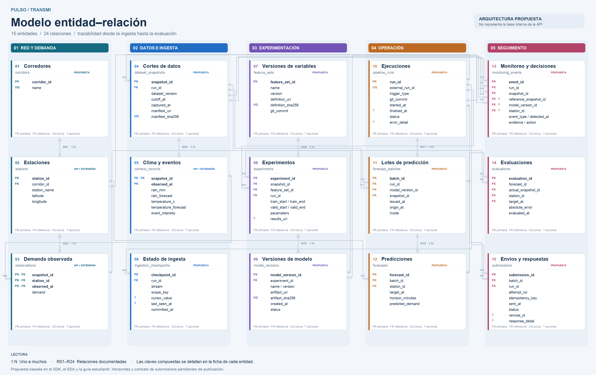

# Modelo entidad–relación · Pulso TransMi

**Propuesta de arquitectura con 15 entidades y 24 relaciones**, basada en el SDK, el EDA y la guía del proyecto. No es el esquema interno de la API ni una migración ejecutada.

- [Abrir versión navegable](modelo-er.html): selecciona una entidad para resaltar sus relaciones y ver tipos, claves y cardinalidades; funciona sin conexión.
- [Esquema vectorial SVG](modelo-er.svg): permite ampliar sin perder nitidez.
- [Imagen PNG](modelo-er.png): lista para incluir en una presentación.

## Alcance y organización

| Dominio | Entidades | Responsabilidad |
|---|---|---|
| Red y demanda | corredores, estaciones, observaciones | Localización y demanda histórica |
| Datos e ingesta | cortes, contexto, checkpoints | Reproducibilidad y avance incremental |
| Experimentación | variables, experimentos, modelos | Entrenamiento versionado y backtesting |
| Operación | ejecuciones, lotes, predicciones | Pronósticos trazables |
| Seguimiento | monitoreo, evaluaciones, envíos | Drift, errores, decisiones y respuestas |

Solo **stations**, **observations** y **context_records** parten de los tres CSV existentes. El modelo los extiende con claves y versionado. Las otras doce entidades son propuestas para cubrir los entregables MLOps; no se afirma que existan en el servidor.

## Cómo leerlo

**PK**: clave primaria. **FK**: referencia a otra entidad. **UQ**: unicidad. **?**: atributo nullable. **1**: exactamente un padre; **0..1**: padre opcional; **0..N**: cero o muchos hijos.

Los conectores R01–R24 representan relaciones a nivel de entidad; su punto de conexión no identifica la fila exacta del atributo. El registro siguiente define las columnas. El círculo en un extremo indica opcionalidad y la pata de cuervo indica multiplicidad. No hay relaciones N:M sin resolver.

La barra `/` agrupa **campos separados** para ahorrar espacio en el dibujo, no una columna con ese nombre. Por ejemplo, `train_start / train_end` son dos timestamps y `name / version` son dos textos. `event_type / detected_at` y `attempt_no / sent_at` combinan los tipos indicados en su ficha.

## Registro de relaciones

| ID | Padre | Hijo | FK en el hijo | Padres por hijo | Hijos por padre |
|---|---|---|---|---|---|
| R01 | `corridors` | `stations` | `corridor_id` | 1 | 0..N |
| R02 | `stations` | `observations` | `station_id` | 1 | 0..N |
| R03 | `dataset_snapshots` | `context_records` | `snapshot_id` | 1 | 0..N |
| R04 | `context_records` | `observations` | `(snapshot_id, observed_at)` | 1 | 0..N |
| R05 | `pipeline_runs` | `dataset_snapshots` | `run_id` | 1 | 0..N |
| R06 | `pipeline_runs` | `ingestion_checkpoints` | `run_id` | 1 | 0..N |
| R07 | `dataset_snapshots` | `experiments` | `snapshot_id` | 1 | 0..N |
| R08 | `feature_sets` | `experiments` | `feature_set_id` | 1 | 0..N |
| R09 | `pipeline_runs` | `experiments` | `run_id` | 1 | 0..N |
| R10 | `experiments` | `model_versions` | `experiment_id` | 1 | 0..N |
| R11 | `pipeline_runs` | `forecast_batches` | `run_id` | 1 | 0..N |
| R12 | `model_versions` | `forecast_batches` | `model_version_id` | 1 | 0..N |
| R13 | `dataset_snapshots` | `forecast_batches` | `snapshot_id` | 1 | 0..N |
| R14 | `forecast_batches` | `forecasts` | `batch_id` | 1 | 0..N |
| R15 | `stations` | `forecasts` | `station_id` | 1 | 0..N |
| R16 | `pipeline_runs` | `monitoring_events` | `run_id` | 1 | 0..N |
| R17 | `dataset_snapshots` | `monitoring_events` | `snapshot_id` | 1 | 0..N |
| R18 | `dataset_snapshots` | `monitoring_events` | `reference_snapshot_id` | 0..1 | 0..N |
| R19 | `model_versions` | `monitoring_events` | `model_version_id` | 0..1 | 0..N |
| R20 | `stations` | `monitoring_events` | `station_id` | 0..1 | 0..N |
| R21 | `forecasts` | `evaluations` | `(forecast_id, station_id, target_at)` | 1 | 0..N |
| R22 | `observations` | `evaluations` | `(actual_snapshot_id, station_id, target_at)` | 1 | 0..N |
| R23 | `forecast_batches` | `submissions` | `batch_id` | 1 | 0..N |
| R24 | `pipeline_runs` | `submissions` | `run_id` | 1 | 0..N |

**Mapeo de claves compuestas:**
- R04: `observations(snapshot_id, observed_at) → context_records(snapshot_id, observed_at)`. Impide mezclar demanda y contexto de cortes distintos. Esta FK ya vincula cada observación a su corte a través del contexto.
- R21: `evaluations(forecast_id, station_id, target_at) → forecasts(forecast_id, station_id, target_at)`.
- R22: `evaluations(actual_snapshot_id, station_id, target_at) → observations(snapshot_id, station_id, observed_at)`.
- R17 y R18 son **dos roles diferentes** de la misma entidad: corte actual y corte de referencia usado para monitorear.

## Diccionario de entidades

### 01. Corredores · `corridors`

Catálogo propuesto a partir de los nombres de corredor de la API.

**Origen:** entidad nueva propuesta.

| Campo(s) | Clave / nulabilidad | Tipo lógico |
|---|---|---|
| `corridor_id` | PK | uuid |
| `name` | UQ | texto |

### 02. Estaciones · `stations`

Datos del catálogo existente; corridor se normaliza como FK. El ID conserva ceros iniciales.

**Origen:** entidad basada en la API, con cambios propuestos.

| Campo(s) | Clave / nulabilidad | Tipo lógico |
|---|---|---|
| `station_id` | PK | texto |
| `corridor_id` | FK | uuid |
| `station_name` | Obligatorio | texto |
| `latitude` | Obligatorio | decimal |
| `longitude` | Obligatorio | decimal |

### 03. Demanda observada · `observations`

PK (snapshot_id, station_id, observed_at). Una fila por estación e instante dentro de cada corte inmutable.

**Origen:** entidad basada en la API, con cambios propuestos.

| Campo(s) | Clave / nulabilidad | Tipo lógico |
|---|---|---|
| `snapshot_id` | PK · FK | uuid |
| `station_id` | PK · FK | texto |
| `observed_at` | PK · FK | timestamptz |
| `demand` | Obligatorio | entero |

### 04. Cortes de datos · `dataset_snapshots`

Manifiesto inmutable con hashes y URIs de observaciones, contexto y catálogo original. Cada corte permite reconstruir sus datos.

**Origen:** entidad nueva propuesta.

| Campo(s) | Clave / nulabilidad | Tipo lógico |
|---|---|---|
| `snapshot_id` | PK | uuid |
| `run_id` | FK | uuid |
| `dataset_version` | Obligatorio | texto |
| `cutoff_at` | Obligatorio | timestamptz |
| `captured_at` | Obligatorio | timestamptz |
| `manifest_uri` | Obligatorio | texto |
| `manifest_sha256` | UQ | texto |

### 05. Clima y eventos · `context_records`

PK (snapshot_id, observed_at). Contexto compartido por las estaciones de un mismo corte e instante.

**Origen:** entidad basada en la API, con cambios propuestos.

| Campo(s) | Clave / nulabilidad | Tipo lógico |
|---|---|---|
| `snapshot_id` | PK · FK | uuid |
| `observed_at` | PK | timestamptz |
| `rain_mm` | Obligatorio | decimal |
| `rain_forecast` | Obligatorio | decimal |
| `temperature_c` | Obligatorio | decimal |
| `temperature_forecast` | Obligatorio | decimal |
| `event_intensity` | Obligatorio | decimal |

### 06. Estado de ingesta · `ingestion_checkpoints`

Historial de checkpoints confirmados por endpoint y filtros. UQ (run_id, stream, scope_key). No se avanza al fallar la persistencia.

**Origen:** entidad nueva propuesta.

| Campo(s) | Clave / nulabilidad | Tipo lógico |
|---|---|---|
| `checkpoint_id` | PK | uuid |
| `run_id` | FK | uuid |
| `stream` | Obligatorio | texto |
| `scope_key` | Obligatorio | texto |
| `cursor_value` | ? | texto |
| `last_seen_at` | ? | timestamptz |
| `committed_at` | Obligatorio | timestamptz |

### 07. Versiones de variables · `feature_sets`

Definición versionada de variables y transformaciones. UQ (name, version); no contiene valores futuros calculados sobre toda la historia.

**Origen:** entidad nueva propuesta.

| Campo(s) | Clave / nulabilidad | Tipo lógico |
|---|---|---|
| `feature_set_id` | PK | uuid |
| `name` | Obligatorio | texto |
| `version` | Obligatorio | texto |
| `definition_uri` | Obligatorio | texto |
| `definition_sha256` | UQ | texto |
| `git_commit` | Obligatorio | texto |

### 08. Experimentos · `experiments`

Cada registro representa una configuración y una ventana de backtesting. Los resultados enlazan un informe reproducible.

**Origen:** entidad nueva propuesta.

| Campo(s) | Clave / nulabilidad | Tipo lógico |
|---|---|---|
| `experiment_id` | PK | uuid |
| `snapshot_id` | FK | uuid |
| `feature_set_id` | FK | uuid |
| `run_id` | FK | uuid |
| `train_start / train_end` | Obligatorio | timestamptz |
| `valid_start / valid_end` | Obligatorio | timestamptz |
| `parameters` | Obligatorio | json |
| `results_uri` | ? | texto |

### 09. Versiones de modelo · `model_versions`

Artefacto inmutable derivado de un experimento. UQ (name, version); la versión usada se fija en cada lote de predicción.

**Origen:** entidad nueva propuesta.

| Campo(s) | Clave / nulabilidad | Tipo lógico |
|---|---|---|
| `model_version_id` | PK | uuid |
| `experiment_id` | FK | uuid |
| `name / version` | Obligatorio | texto |
| `artifact_uri` | Obligatorio | texto |
| `artifact_sha256` | UQ | texto |
| `created_at` | Obligatorio | timestamptz |
| `status` | Obligatorio | texto |

### 10. Ejecuciones · `pipeline_runs`

Una ejecución de pipeline, incluida la identificación del intento externo. Registra fallos aunque no produzca datos ni modelos.

**Origen:** entidad nueva propuesta.

| Campo(s) | Clave / nulabilidad | Tipo lógico |
|---|---|---|
| `run_id` | PK | uuid |
| `external_run_id` | UQ | texto |
| `trigger_type` | Obligatorio | texto |
| `git_commit` | Obligatorio | texto |
| `started_at` | Obligatorio | timestamptz |
| `finished_at` | ? | timestamptz |
| `status` | Obligatorio | texto |
| `error_detail` | ? | texto |

### 11. Lotes de predicción · `forecast_batches`

Fija modelo, datos y origen del pronóstico. mode distingue backtest y operación; issued_at es el momento de creación real.

**Origen:** entidad nueva propuesta.

| Campo(s) | Clave / nulabilidad | Tipo lógico |
|---|---|---|
| `batch_id` | PK | uuid |
| `run_id` | FK | uuid |
| `model_version_id` | FK | uuid |
| `snapshot_id` | FK | uuid |
| `issued_at` | Obligatorio | timestamptz |
| `origin_at` | Obligatorio | timestamptz |
| `mode` | Obligatorio | texto |

### 12. Predicciones · `forecasts`

UQ (batch_id, station_id, target_at). Un lote puede incluir varias estaciones y horizontes. Horizonte relativo a origin_at.

**Origen:** entidad nueva propuesta.

| Campo(s) | Clave / nulabilidad | Tipo lógico |
|---|---|---|
| `forecast_id` | PK | uuid |
| `batch_id` | FK | uuid |
| `station_id` | FK | texto |
| `target_at` | Obligatorio | timestamptz |
| `horizon_minutes` | Obligatorio | entero |
| `predicted_demand` | Obligatorio | decimal |

### 13. Monitoreo y decisiones · `monitoring_events`

Calidad, drift y decisiones de conservar/reentrenar. evidence guarda método, ventanas, umbrales y resultados; sin modelo para alertas de ingesta.

**Origen:** entidad nueva propuesta.

| Campo(s) | Clave / nulabilidad | Tipo lógico |
|---|---|---|
| `event_id` | PK | uuid |
| `run_id` | FK | uuid |
| `snapshot_id` | FK | uuid |
| `reference_snapshot_id` | FK · ? | uuid |
| `model_version_id` | FK · ? | uuid |
| `station_id` | FK · ? | texto |
| `event_type / detected_at` | Obligatorio | texto / timestamptz |
| `evidence / action` | Obligatorio | json / texto |

### 14. Evaluaciones · `evaluations`

UQ (forecast_id, actual_snapshot_id). Une una predicción a una observación exacta; permite reevaluar contra revisiones de datos.

**Origen:** entidad nueva propuesta.

| Campo(s) | Clave / nulabilidad | Tipo lógico |
|---|---|---|
| `evaluation_id` | PK | uuid |
| `forecast_id` | FK | uuid |
| `actual_snapshot_id` | FK | uuid |
| `station_id` | FK | texto |
| `target_at` | FK | timestamptz |
| `absolute_error` | Obligatorio | decimal |
| `evaluated_at` | Obligatorio | timestamptz |

### 15. Envíos y respuestas · `submissions`

Un registro por intento. UQ (batch_id, attempt_no). Contrato propuesto pendiente de la API competitiva; no contiene credenciales.

**Origen:** entidad nueva propuesta.

| Campo(s) | Clave / nulabilidad | Tipo lógico |
|---|---|---|
| `submission_id` | PK | uuid |
| `batch_id` | FK | uuid |
| `run_id` | FK | uuid |
| `attempt_no` | Obligatorio | entero |
| `idempotency_key` | Obligatorio | texto |
| `sent_at` | Obligatorio | timestamptz |
| `status` | Obligatorio | texto |
| `remote_id` | ? | texto |
| `response_detail` | ? | json |

## Integridad y reglas de negocio

1. **Versionado de datos.** Cada corte identifica un conjunto completo e inmutable de observaciones y contexto. Las PK de ambas tablas incluyen `snapshot_id`. Los cortes pueden duplicar contenido lógico entre versiones: es el costo explícito de este diseño de snapshots. Una implementación grande podría usar almacenamiento inmutable externo y manifests sin duplicar filas, manteniendo los mismos vínculos de procedencia.
2. **Snapshot reproducible.** `manifest_uri` apunta a un manifiesto cuyo hash es `manifest_sha256`; contiene hashes y ubicaciones inmutables de todos los archivos, incluido el catálogo de estaciones. No basta con guardar la URL mutable de descarga de la API. El catálogo relacional `stations` mantiene el estado actual; el catálogo histórico se recupera del manifiesto.
3. **Claves de negocio.** `corridors.name`, `feature_sets(name, version)`, `model_versions(name, version)`, `forecasts(batch_id, station_id, target_at)`, `evaluations(forecast_id, actual_snapshot_id)`, `ingestion_checkpoints(run_id, stream, scope_key)` y `submissions(batch_id, attempt_no)` son únicos. Agregar UQ `forecasts(forecast_id, station_id, target_at)` como destino de R21. Las PK compuestas de observaciones y contexto son las especificadas arriba.
4. **Claves foráneas sin referencias ambiguas.** Una evaluación tiene que coincidir tanto con la estación y objetivo de la predicción como con una observación del corte de evaluación. No se enlaza solo por timestamp. Los campos repetidos `station_id` y `target_at` permiten imponer las dos FK compuestas.
5. **Ingesta atómica.** Confirmar los datos antes de agregar el checkpoint; ambos cambios pertenecen a una transacción cuando se persisten en la misma base. `scope_key` identifica de forma canónica endpoint y filtros. La ejecución fallida permanece registrada. Al reanudar, seleccionar el último checkpoint confirmado para ese stream y scope.
6. **Cursores.** Conservar el cursor opaco sin alterarlo, incluyendo su alcance. Si la API no garantiza su validez entre cortes, usar una ventana de solapamiento temporal y deduplicar por clave; no asumir que un timestamp basta para ordenar las 12 estaciones. El último timestamp también se registra para diagnóstico.
7. **Tiempo y fuga de información.** Todos los instantes incluyen zona horaria. Para experimentos: `train_start <= train_end < valid_start <= valid_end <= snapshot.cutoff_at`. Las transformaciones se ajustan con el entrenamiento. En operación, el corte no supera el origen del pronóstico y `origin_at <= issued_at`. En backtesting, un snapshot puede incluir validación futura respecto al origen simulado, pero las variables solo pueden usar información disponible en ese origen.
8. **Horizontes.** `horizon_minutes > 0`, múltiplo de 15 para el contrato actual, y `target_at = forecast_batches.origin_at + horizon_minutes`. No se inventan las duraciones de los cuatro horizontes: se configurarán cuando se publiquen. La emisión real del lote se distingue del origen simulado de backtesting.
9. **Rangos.** Demanda observada entera y no negativa; predicción finita y no negativa; latitud en [-90, 90], longitud en [-180, 180]; errores absolutos no negativos. No se presupone un techo de demanda. Lluvia e intensidad requieren sus validaciones acordes al contrato.
10. **Métricas.** `absolute_error = abs(observed_demand - predicted_demand)` es un valor derivado que debe calcularse y verificarse, no editarse libremente. WAPE se obtiene por estación y ventana como suma de errores / suma de demanda observada; accuracy es `100 × max(0, 1 − WAPE)`. Si el denominador es cero, la política debe ser explícita. No promediar errores porcentuales individuales ni combinar varias revisiones o predicciones del mismo objetivo sin seleccionar primero el conjunto de evaluación.
11. **Reevaluación.** Una revisión del dato real puede producir otra evaluación de la misma predicción con diferente `actual_snapshot_id`. Para informes, seleccionar explícitamente la versión de verdad usada. Los reportes de experimentos se conservan en `results_uri`; las evaluaciones detalladas pueden provenir de lotes con `mode=backtest`.
12. **Monitoreo.** `evidence` guarda método, variable, ventana de referencia/actual, tamaño de muestra, estadístico, umbral, unidades y motivo de la acción. `reference_snapshot_id` es opcional para controles que no comparan cortes, pero obligatorio si se declara un análisis entre cortes. `model_version_id` puede faltar en controles de datos; `station_id` nulo identifica alcance global. Una señal no prueba automáticamente drift de concepto.
13. **Envíos.** `status` es obligatorio; `remote_id` y `response_detail` son opcionales. `attempt_no >= 1`. Los reintentos del mismo lote usan una clave de idempotencia estable si el servidor la admite, por eso esa clave no es única por intento. No se guardan API keys. El contrato HTTP de envío aún está pendiente.
14. **Ejecuciones y artefactos.** `external_run_id` debe identificar proveedor, repositorio, ejecución e intento, para evitar colisiones. `finished_at` puede faltar mientras una ejecución esté activa; si existe, no es anterior a `started_at`. Los hashes de artefactos y definiciones evitan duplicados de contenido; las versiones conservadas son inmutables.
15. **Borrado e implementación.** Restringir el borrado de datos, modelos o ejecuciones referenciados por predicciones y evaluaciones. Estados y transiciones deben validarse en la implementación. Las reglas que cruzan tablas requieren controles transaccionales o validación en la capa de persistencia; no se presentan como CHECK locales ya implementados.

## Flujo que soporta

1. `pipeline_runs` registra el intento de ingesta.
2. Se crea `dataset_snapshots`, se carga contexto/demanda y se confirma `ingestion_checkpoints`.
3. `experiments` fija corte, variables, ejecución y ventanas; produce `model_versions`.
4. `forecast_batches` fija modelo, origen y corte usado; `forecasts` almacena cada estación/horizonte.
5. `submissions` registra intentos y respuestas del servidor cuando ese servicio exista.
6. Con datos reales disponibles, `evaluations` enlaza predicción y observación exactas.
7. `monitoring_events` registra evidencia y decisiones de conservar o reentrenar.

No se crean entidades decorativas para completar el número: cada tabla resuelve un requisito del reto. Usuarios, roles, pagos, rutas y leaderboard quedan fuera porque no se dispone de su contrato ni son necesarios para esta propuesta.

## Fuentes y estado

- [README del SDK](../README.md).
- [Guía del proyecto estudiantil](../docs/student-project.md).
- [API de lectura](../docs/api.md).
- [EDA ejecutado](../eda%20proyecto/eda_pulso_transmi.ipynb).

Los archivos de esta carpeta son documentación del diseño. No se crearon tablas, migraciones ni recursos externos.
